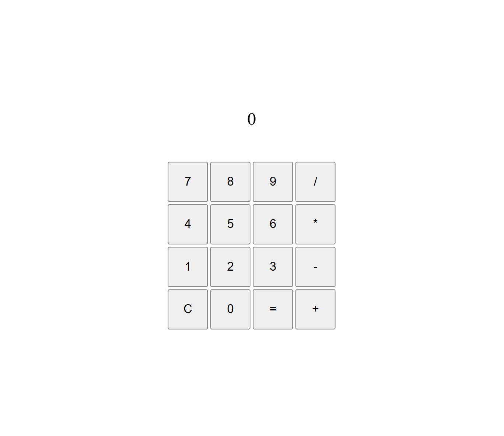

# Project: Calculator

## Description

In this project, I created an browser calculator using HTML, CSS, and JavaScript.
- Live preview: https://averdonks.github.io/calculator/

## Features

- Math operations including:
    - `/`: division
    - `*`: multiplication
    - `-`: subtraction
    - `+`: addition
- Reset the display with: `C`
- Perform operations with: `=`
- Convert numbers up to and above 1,000,000 to exponential notation
- Prevent division by zero

## Image Preview

## Technologies Used

- HTML
- CSS
- JavaScript

## Reflection

This project was quite difficult to figure out, but I'm glad I persevered through to the end. This concludes my study in [the odin project foundations course](https://www.theodinproject.com/paths/foundations/courses/foundations). Next, I plan to start a Software Engineering degree at WGU.
